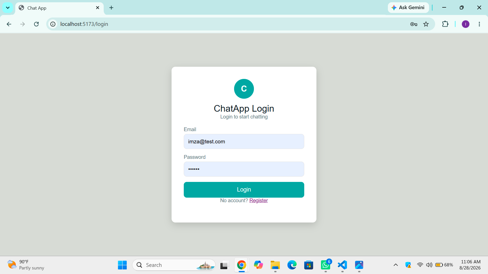
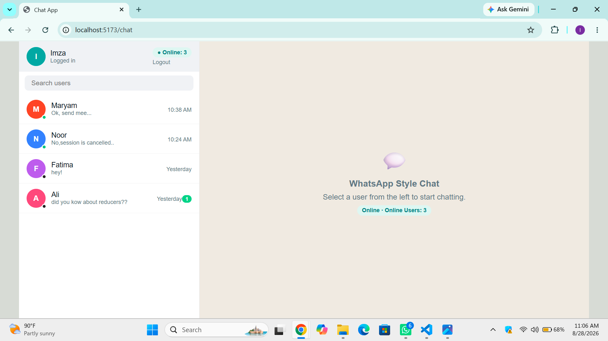
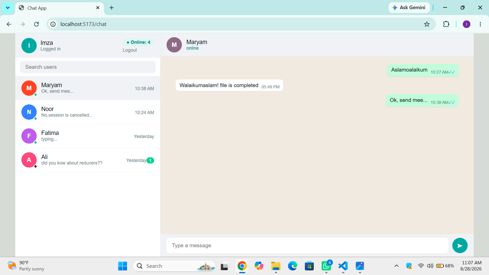
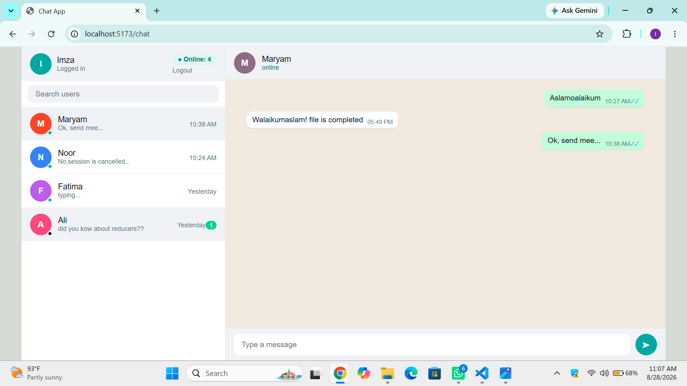
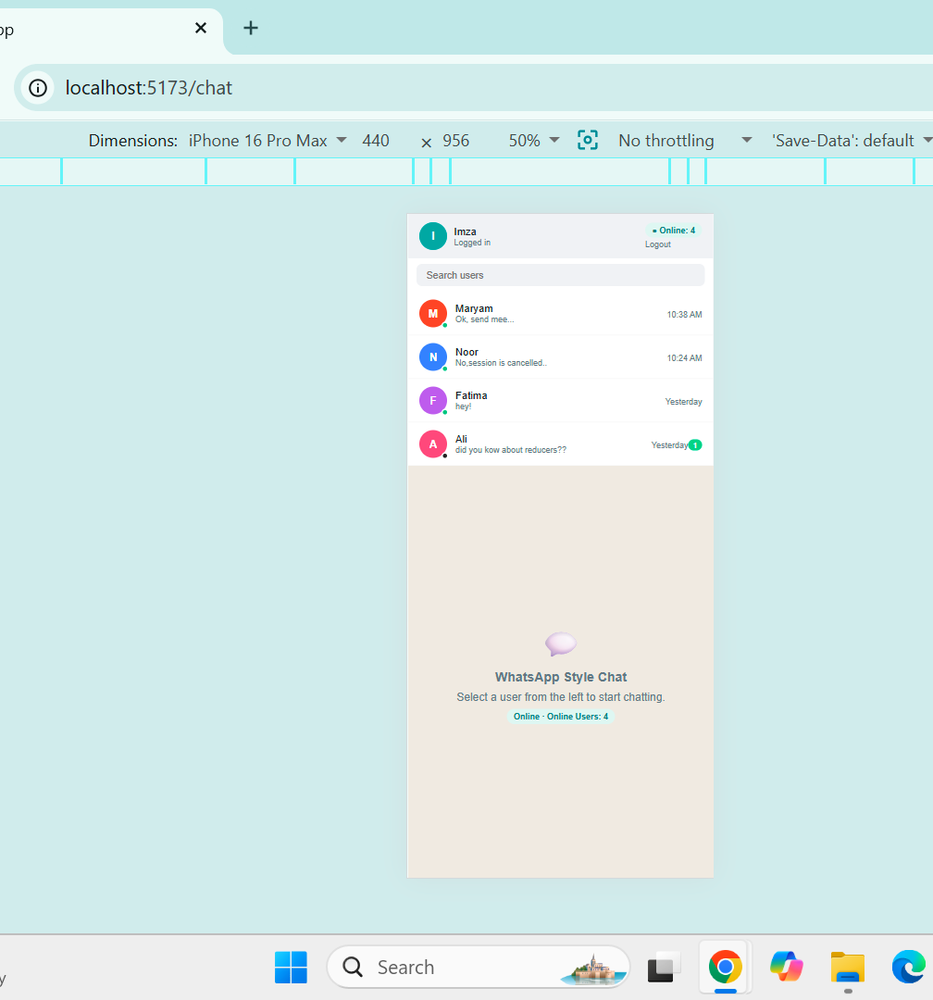
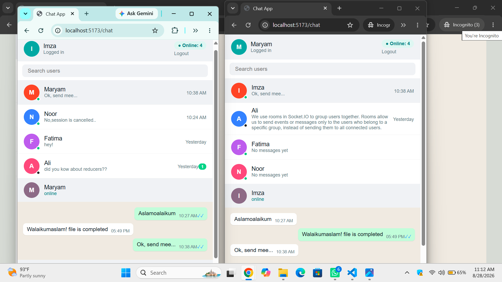

# 💬 Chat App Assignment

### A WhatsApp-style Real-Time Chat Application

A full-stack real-time chat application built with the **MERN Stack, Socket.IO, and Redux Toolkit**. The application supports secure authentication, real-time messaging, online/offline status, typing indicators, read receipts, unread messages, message history, and responsive mobile design.

---

## 👩‍💻 Student

**Imza Sarwar**

## 🚀 Technologies

| Technology       | Purpose                 |
| ---------------- | ----------------------- |
| ⚛️ React.js      | Frontend UI             |
| 🟢 Node.js       | Backend runtime         |
| 🚂 Express.js    | REST API                |
| 🍃 MongoDB       | Database                |
| 🧩 Mongoose      | MongoDB ODM             |
| 🔌 Socket.IO     | Real-time communication |
| 🔄 Redux Toolkit | State management        |
| 🔐 JWT           | Authentication          |
| 📡 Axios         | API requests            |
| 🎨 CSS           | Responsive styling      |

---

## ✨ Features

### 🔐 Authentication

* User registration
* User login
* JWT-based authentication
* Protected user information
* Logout functionality

### 💬 Real-Time Chat

* Real-time messaging using Socket.IO
* Two users can chat simultaneously
* Message history
* Messages stored permanently in MongoDB
* Messages remain available after page refresh

### 🟢 Online / Offline System

* Online user status
* Offline user status
* Online user count
* Real-time online user list

### ✍️ Typing Indicator

* Real-time typing indicator
* Shows when another user is typing

### 📩 Read & Unread Messages

* Unread message count
* Read message functionality
* Blue read ticks
* Real-time unread count updates

### 🔎 User Experience

* User search
* Last message preview
* Message time
* Responsive mobile layout
* WhatsApp-style chat interface

---

## 📁 Project Structure

```text
chat-app-assignment/
│
├── client/
│   ├── src/
│   ├── package.json
│   ├── package-lock.json
│   └── vite.config.js
│
├── server/
│   ├── connection/
│   ├── controllers/
│   ├── cookie/
│   ├── middleware/
│   ├── models/
│   ├── route/
│   ├── main.js
│   ├── socket.js
│   ├── package.json
│   └── package-lock.json
│
├── screenshots/
│   ├── chat.png
│   ├── login.png
│   ├── mobile.png
│   ├── two-users.png
│   ├── unread.png
│   └── userList.png
│
├── .gitignore
└── README.md
```

---

# ⚙️ How to Run

## 1. Clone the Repository

```bash
git clone https://github.com/imza-s988/chat-app-assignment.git
cd chat-app-assignment
```

---

## 2. Run the Backend

Open a terminal and move into the server folder:

```bash
cd server
```

Install dependencies:

```bash
npm install
```

Create a `.env` file inside the `server` folder.

Example:

```env
PORT=3000
MONGO_URI=your_mongodb_connection_string
JWT_SECRET=your_secret_key
CLIENT_URL=http://localhost:5173
```

Start the backend:

```bash
npm run dev
```

Backend:

```text
http://localhost:3000
```

---

## 3. Run the Frontend

Open another terminal:

```bash
cd client
```

Install dependencies:

```bash
npm install
```

Start the frontend:

```bash
npm run dev
```

Frontend:

```text
http://localhost:5173
```

---

## 🌐 Open the Application

Open your browser and visit:

```text
http://localhost:5173
```

---

# 🔑 Environment Variables

For security, the actual `.env` file is **not included in GitHub**.

The project uses `.env.example` as a template.

```env
PORT=3000
MONGO_URI=your_mongodb_connection_string
JWT_SECRET=your_secret_key
CLIENT_URL=http://localhost:5173
```

The `.env` file is protected by `.gitignore`.

---

# 🔌 Socket.IO Events

The application uses Socket.IO for real-time communication.

### Connection Events

```text
connect
disconnect
connect_error
```

### Online Status

```text
online:count
online:users
```

### Chat Events

```text
chat:send
chat:message
chat:history
```

### Read / Unread Events

```text
chat:unread
chat:unread:update
chat:read
```

### Typing

```text
chat:typing
```

---

## 📡 Socket Event Description

| Event                | Purpose                                    |
| -------------------- | ------------------------------------------ |
| `connect`            | Detects when the socket connects           |
| `disconnect`         | Detects when the socket disconnects        |
| `connect_error`      | Handles socket connection errors           |
| `online:count`       | Sends the number of currently online users |
| `online:users`       | Sends IDs of currently online users        |
| `chat:send`          | Sends a new chat message                   |
| `chat:message`       | Receives a new message in real time        |
| `chat:history`       | Loads previous messages                    |
| `chat:unread`        | Gets existing unread messages              |
| `chat:unread:update` | Updates unread message count               |
| `chat:read`          | Marks messages as read                     |
| `chat:typing`        | Shows the typing indicator                 |

---

# 🗄️ Database

MongoDB is used to store **users and chat messages**.

Messages remain stored in the database, so the conversation is not lost when the browser is refreshed.

Each message contains information such as:

* Message text
* Sender
* Recipient
* Read/unread status
* Creation time

---

# 🧪 Testing

The application was tested using two browser sessions:

* 🌐 Normal browser window
* 🕵️ Incognito browser window

This allows two different users to log in simultaneously and communicate in real time.

### Tested Functionality

* ✅ Registration
* ✅ Login
* ✅ User list
* ✅ Online/offline status
* ✅ Online user count
* ✅ Real-time messaging
* ✅ Real-time message receiving
* ✅ Typing indicator
* ✅ Unread message count
* ✅ Read messages
* ✅ Blue read ticks
* ✅ Message history
* ✅ Refresh persistence
* ✅ User search
* ✅ Logout
* ✅ Mobile responsive layout
* ✅ Two-user real-time chat

---

# 📸 Screenshots

## 🔐 Login



---

## 👥 User List



---

## 💬 Chat



---

## 🔴 Unread Messages



---

## 📱 Mobile View



---

## 👥 Two Users Chatting



---

# 🖼️ How Screenshots Work

The screenshots are stored inside the project's `screenshots` folder.

For example:

```text
screenshots/
└── login.png
```

The README references it using:

```markdown

```

Because the image is inside the repository, GitHub automatically displays it when someone opens the README.

---

# 🔗 GitHub Repository

**Chat App Assignment**

https://github.com/imza-s988/chat-app-assignment

---

# 🎯 Conclusion

This project demonstrates the development of a **full-stack WhatsApp-style real-time chat application** using modern web technologies.

The application combines **React, Node.js, Express, MongoDB, Redux Toolkit, JWT Authentication, and Socket.IO** to provide a complete real-time messaging experience.

It includes authentication, real-time communication, online/offline presence, typing indicators, unread messages, read receipts, message history, persistent database storage, user search, and responsive mobile support.

---

### ⭐ Project Highlights

**MERN Stack + Socket.IO + Redux Toolkit + JWT + Real-Time Messaging**

**Built by Imza Sarwar**
